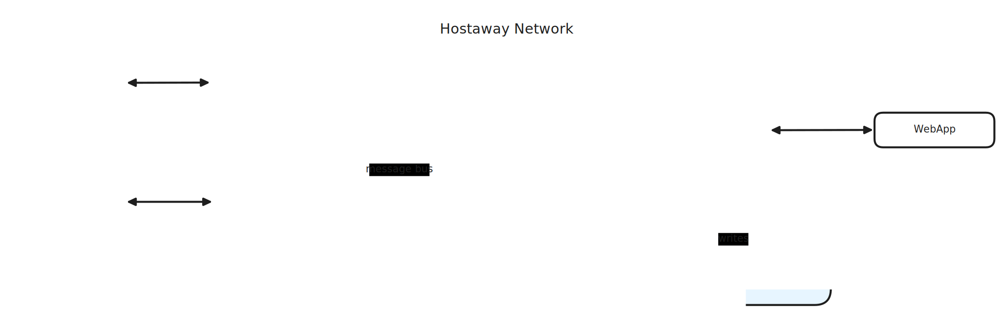
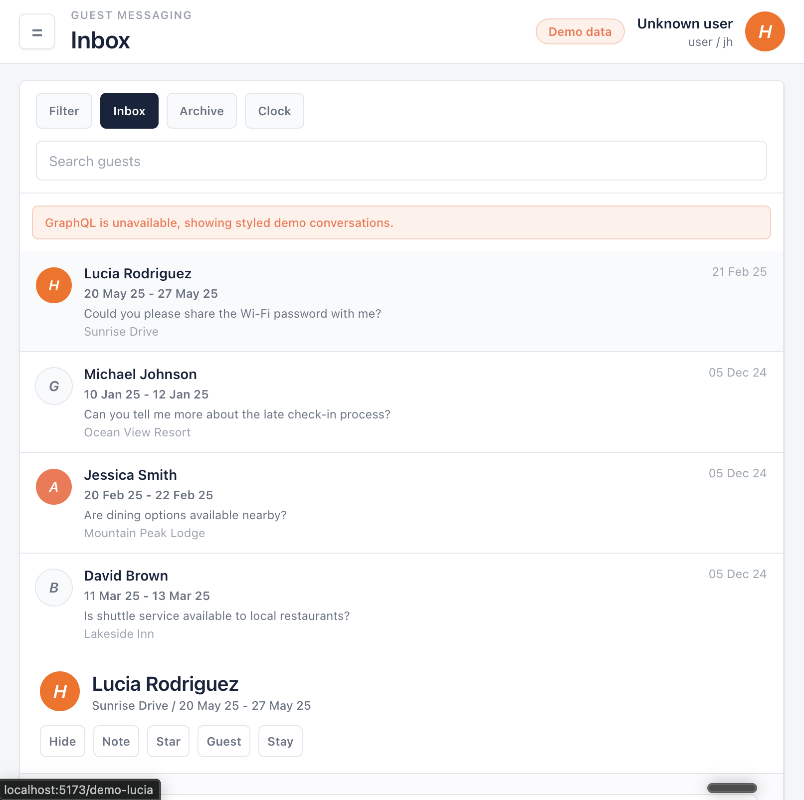
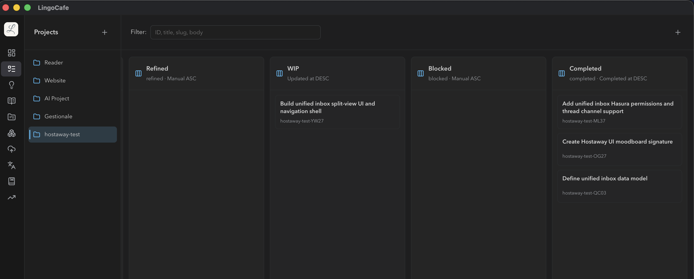

# Hostaway Code Test

Hello Dear Reviewer,  
Thank you for taking the time to review this work.

Before you continue, let me say that it's been fun, **and actually difficult** to work this out in the alloted timebox - which I have failed by about 50%.

In this document you will find a **detailed journal of the development experience**. Each step links to the relevant commit so you can easily check it out and "watch" my progress through the exercise.

For this test I used:

- coffee, lot of it
- Codex
- Docker & Docker Compose
- Hasura.io
- React / Apollo Client / React Router / Tailwind
- more coffee

## QuickStart

```bash
# This should work on Mac and Linux.
make boot

# If it doesn't, try this.
docker compose up -d
(cd apps/webapp && npm install && npm run dev)

# If it still doesnt work,
echo "Call me in for the discussion anyway and we can check it out together ;-)"
```

You should get the app going at:  
http://localhost:5173

You can inspect the Hasura project & data model at:  
http://localhost:8080
(password: hasura)

**NOTE:** You can ask your AI more or less any details. It should be able to guide you through it.

## 🤖 A Word About AI

I have used AI heavily during this task. And in a way more aggressive way that I would do for a real app, **or suggest to do in public**.

Even so, I used a set of skills that I keep curating over and over, project after project.
These are the `backlog-*` and `vibe-*` skills.

Even if I dared push hard on the accelerator, you will find that every idea, refinement Q&A, development plan and execution notes are documented in a file-system indexed backlog.

In the **Age of Agents** this becomes a super-power of natural documentation, from which is possible to extract so much value. So part of this exercise is to share with you a possible approach to AI-assisted development.

Is the quality good enough?  
_Well, it's not as good as if I did write everything my self._

How long would have taken to reach the same result?  
And write this README along the way?  
_Many days._

Codex threads:

- [019e4aad-46fb-7bd1-98fc-7280ec5e4ebd](./docs/codex/pretty/019e4aad-46fb-7bd1-98fc-7280ec5e4ebd.json) ([raw](./docs/codex/raw/019e4aad-46fb-7bd1-98fc-7280ec5e4ebd))
- [019e4ace-8a52-7631-8aa8-f6b2f79ae96b](./docs/codex/pretty/019e4ace-8a52-7631-8aa8-f6b2f79ae96b.json) ([raw](./docs/codex/raw/019e4ace-8a52-7631-8aa8-f6b2f79ae96b))
- [019e4ae7-7d44-7ff1-8c11-6206282e0532](./docs/codex/pretty/019e4ae7-7d44-7ff1-8c11-6206282e0532.json) ([raw](./docs/codex/raw/019e4ae7-7d44-7ff1-8c11-6206282e0532))
- [019e4aff-b2d1-70d1-95a9-4181a7266902](./docs/codex/pretty/019e4aff-b2d1-70d1-95a9-4181a7266902.json) ([raw](./docs/codex/raw/019e4aff-b2d1-70d1-95a9-4181a7266902))
- [019e4b17-e439-74e0-803e-d276a4a70b74](./docs/codex/pretty/019e4b17-e439-74e0-803e-d276a4a70b74.json) ([raw](./docs/codex/raw/019e4b17-e439-74e0-803e-d276a4a70b74))

## System Design



### Adapter Pattern

At system design, I would use an _adapter pattern_ to interface with the different data providers. Each adapter knows the specific provider's API, and the internal communication logic.

Each adapter communicates with the _Aggregation Service_ via events in an _Event Sourcing_ fashion. Based on the amount of data, I would think what service to use. But one common and very hyped choice is Kafka.

### Aggregation Service

It's the source of truth for the internal data model.

It talks with the adapters via bus and it is in charge of materializing those events in a database of sort.

For this exercise I picked Postgres because I know it well and [I believe it's awesome](https://postgresforeverything.com/) 😉.

IMPORTANT: for the sake of this exercise I assume this service is also in charge of keeping read-ready tables from different internal events streams from other domain-specific services (auth, listing, bookings, ...)

### BFF

The frontend(s) would mediate access to the internal data model via BFF:

- it knows the common data model (read only)
- it implements an outbox pattern to send commands towards the adapters

### Real Time

The exercise mentions _real time_ expectations. 2h is a bit on the short side to make a full custom design around it.

My first idea was to go with a Fastify/TypeScript BFF so to use tRPC for bff/frontend type-safe continuity, use Postgres as development bus for events, and _Server Side Events_ as monodirectional push channel.

After thorough evaluation (~30 seconds) I've decided this is too ambitious for 2h. I will short cut it and use GraphQL with Hasura ([see Tech Stack](#tech-stack)) so that I get the subscriptions for free.

## Tech Stack

For this exercise I use [Hasura](https://hasura.io) as interface "data model <-> graphql". The APIs that I plan to expose are mainly defined by the data model itself, and the Hasura's ACL metadata.

The frontend is a React app that uses Apollo Client for GraphQL communication and React Router (TanStack) for internal app routing.

The UI is based on Tailwind and I will try to convert a few screenshot from the website into an agent skill to comply with the requirement **"consistent with our branding"**. Let's hope it will work!

> **IMPORTANT:** I'm importing code from another project as boilerplate. I don't think you want to assess how good I am at following tutorials to wire together a few existing tools anyway, and this will buy me time to focus on the data model and the app itself.

## Development Log

### 14:30 Go!

- Imagined and document (here, up above) the system design.
- Evaluated and decided the technical stack

`git checkout b2fdf481e9fc47ca0ac5f6d21b4321302d7a44d1`

### 14:40 Boilerplate & Cleanup

As mentioned, I'm going to copy over from another project.

`git checkout 0fb4b7832b11a03eaf52b90068136fa3e282bc9e`

### 15:14 Design Data Model

This is the tough one.

Honestly, I'm wasting time thinking that every channel may have its own internal representation of listings, guests, and bookings.

I'm going to make some wild simplifications here.  
The more I dig into the draft task, the more I realize it's not a kid's game.  
I will not manage view receipts or stuff like that.  
Maybe tonight.

`git checkout d19da00ad8ad91b5a687d75b3ee4e4febbad9136`

### 15:50 Design Mood Board

Started the task to extract mood board for ui from screenshot.  
This is a long shot.  
Let's see.

The result of this step is a mocked UI that looks rather nice to me:


`git checkout 3aa66b72c6779f84abb654a8dbc6fc295aede9cd``

### ~2h and a Half

Ok, I'm out of the basic allotted time. That's the status update:

- basic system design in place
- basic unified data model propsal in place (I did that waayyyyy to quickly though, it leaks!)
- basic UI definition and driving skill in place
- replicable system in place, should be very developer friendly and AI-enabled

I worked this out in a light-speed spec-driven so it's possible to follow each task, refinement, implementation plan and execution notes:



_(I have a local Electron App that let me visually follow and manage my in-repo backlogs 😉)_

There is a massive feature ongoing (YW27) that potentially will implement one-shot the whole basic working demo. I have mixed feelings about it, it's a lot in one single feature.

### 16:40 Massive Task

I have drafted a MASSIVE TASK (I would NEVER do that for real... this was a real stretch... but it's a first iteration and I'm out of time) to generate the functionalities all at once.

It worked better than expected, but there is a lot of work to still do to make this MVP good for a presentation.

`git checkout e0fc48eccd7c09371109affef45d3100d10f1228`

### 17:11 Vibe Coding my Way Forward

I will now start a vibe coding session that will be recorded and documented as part of my development lifecycle.

## Conclusions

Thank you for this test. It made me take a quick look under the hood at the complexity that Hostaway manages.

If the goal was to scare me away, sorry. I don't scare easy 🤘.

### It's an MVP!

This MVP shows some potential features in the Unified Inbox:

- helicopter view with stats and labels
- AI-driven mood & topic analysis (this is done by a thrid party service ofc)
- optimistic outbox pattern (the full BFF is just a localized materialization of events from a variety of micro-services in Hostaway!)
- live updates
- give or take: multi-tenant multi-operator, multi-guest booking data model

I flag this solution as a basic POC, a clickable mockup.  
In my book, this is not yet a "first iteration".

### Testing

I didn't have the time to test ANYTHING.
I took a look at the proposed execution plan and the hasura metadata and it looks Codex did well - it usually does. But I haven't tested it.

My testing strategy for this project would be:

- Vitest based API happi paths / edge cases with different credentials to probe the configuration
- Playwrigth for E2E testing on the UI

The backend is basically ready for it, we have a programmatic way to reset/restore a state of the app, and it can be applied to Testcontainers to parallelize it as well.

### Data Bottleneck

I've heavily relied on GraphQL-based aggregations.  
That would kill the most powerful server in production, with a decent amount of customers.

Moving forward, I'd introduce a metrics service that consumes the very same messages from the bus, but keeps counters up-to-date so that different entities (from dashboard to the threads) enjoy eventual-consistency but cheap-to-read metrics.
